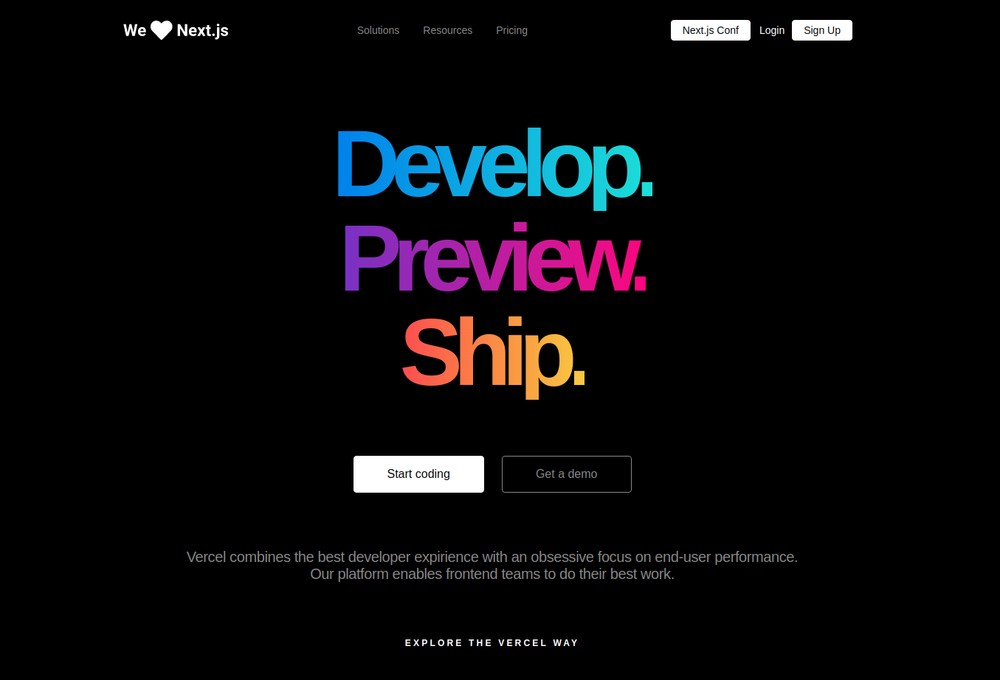

<div align="center"></div>



<p align="center">A clone of the animated homepage from Vercel</p>

## 🛠️ Technologies

<ul>
  <li><a href="https://reactjs.org/">React</a></li>
  <li><a href="https://developer.mozilla.org/pt-BR/docs/Web/HTML">HTML</a></li>
  <li><a href="https://sass-lang.com/documentation/syntax">SCSS</a></li>
</ul>

## ⚙️ Requirements

<ul>
  <li><a href="https://git-scm.com/">Git</a></li>
  <li><a href="https://nodejs.org/en/">Node.js</a></li>
  <li><a href="https://www.npmjs.com/">NPM</a></li>
</ul>

## 🚀 Installation

```
$ git clone https://github.com/gabrielsanttana/vercel-homepage
$ cd vercel-homepage
$ npm install
$ npm start
```

The application is going to open in the browser on http://localhost:3000
